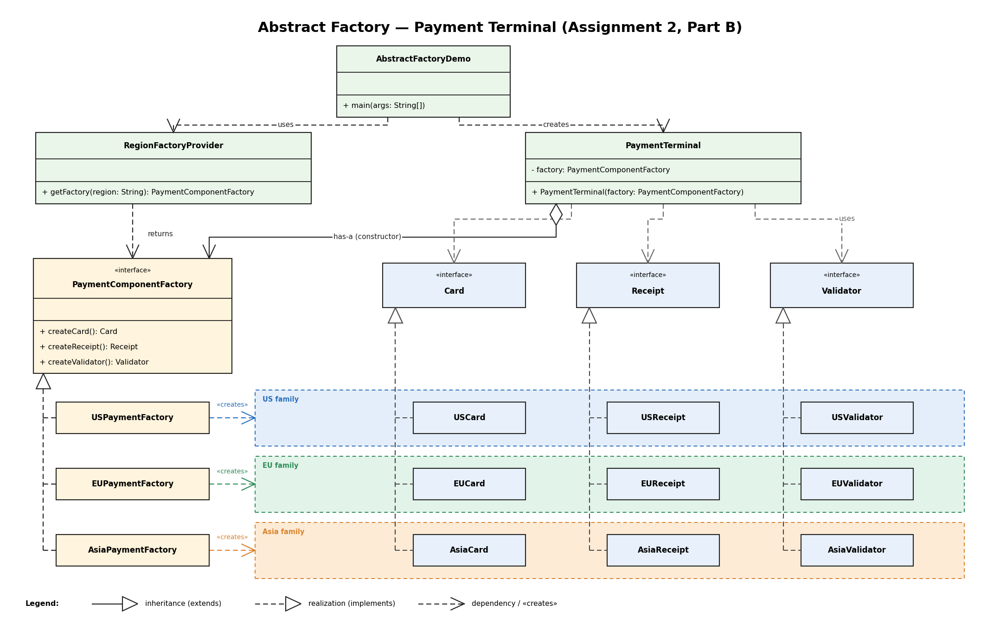

# Assignment 2 — Creational Patterns: Factory Method & Abstract Factory

**Theme:** Payment Terminal

## Structure

```
assignment2-design-patterns/
├── src/
│   ├── factorymethod/     (Part A)
│   └── abstractfactory/   (Part B)
└── README.md
```

## Part A — Factory Method

**Goal:** create a single product — a `PaymentProcessor` — without the client ever calling `new ConcreteProduct()`.

- `PaymentProcessor` — product interface, one meaningful method `processPayment(double amount)`.
- `VisaPaymentProcessor`, `MasterCardPaymentProcessor`, `LocalCardPaymentProcessor` — three concrete products, each with a different fee percentage and a different approval code prefix, so behaviour is genuinely distinct, not just a renamed class.
- `PaymentGateway` — abstract creator. Declares the factory method `createProcessor()` and contains the business method `processTransaction(double amount)`, which calls `createProcessor()` and then uses the returned object only through the `PaymentProcessor` interface.
- `VisaGateway`, `MasterCardGateway`, `LocalCardGateway` — concrete creators, each overriding `createProcessor()` to return its own product.
- `FactoryMethodDemo` — client. It picks a `PaymentGateway` from a map by card type and calls `processTransaction(amount)`. It never instantiates any `PaymentProcessor` implementation directly — only the corresponding `PaymentGateway` does that, inside its overridden factory method.

Run:
```
javac -d out src/factorymethod/*.java
java -cp out factorymethod.FactoryMethodDemo
```

## Part B — Abstract Factory

**Goal:** create a *consistent family* of products — `Card`, `Receipt`, `Validator` — that must all belong to the same region. Mixing regions is impossible because the client only ever asks one factory for all three.

- `Card`, `Receipt`, `Validator` — the abstract product interfaces that belong together.
- `PaymentComponentFactory` — abstract factory interface with one creation method per product: `createCard()`, `createReceipt()`, `createValidator()`.
- `USPaymentFactory`, `EUPaymentFactory`, `AsiaPaymentFactory` — concrete factories. Each one only ever returns objects from its own region (`USCard`+`USReceipt`+`USValidator`, etc.), so the family is internally consistent by construction — there is no code path that lets a `USCard` end up paired with a `EUReceipt`.
- `RegionFactoryProvider` — the single place in the program where a region string is turned into a concrete factory (`getFactory(String region)`). This is the *one place* where the family is selected.
- `PaymentTerminal` — client. It receives a `PaymentComponentFactory` through its constructor (composition, not inheritance) and only ever calls methods on `Card`, `Receipt`, `Validator`, `PaymentComponentFactory`. It has no reference anywhere to `USCard`, `EUReceipt`, `AsiaValidator`, etc.
- `AbstractFactoryDemo` — builds three `PaymentTerminal` instances, one per region, each wired up through `RegionFactoryProvider.getFactory(...)`, and runs a checkout on each.

Run:
```
javac -d out src/abstractfactory/*.java
java -cp out abstractfactory.AbstractFactoryDemo
```

## Factory Method vs Abstract Factory — the actual difference in this code

- **Mechanism.** Factory Method relies on **inheritance**: `VisaGateway` *is a* `PaymentGateway` and overrides one method. Abstract Factory relies on **composition**: `PaymentTerminal` *has a* `PaymentComponentFactory` passed into its constructor; there is no inheritance relationship between `PaymentTerminal` and any concrete factory.
- **How many products.** Each `PaymentGateway` subclass creates exactly **one** product (a `PaymentProcessor`). Each `PaymentComponentFactory` implementation creates **three** related products (`Card`, `Receipt`, `Validator`) that are guaranteed to match.
- **What breaks if you add a new variant.** Adding a fourth card network in Part A means adding one new `PaymentProcessor` + one new `PaymentGateway` subclass — nothing existing changes. Adding a fourth region in Part B means adding three new product classes + one new factory class — still no existing class changes (Open/Closed Principle holds in both parts). But adding a **new kind of product** to the Part B family (e.g. a `LoyaltyCard` component) means changing the `PaymentComponentFactory` interface itself and every concrete factory that implements it — that is the known weak spot of Abstract Factory, and it is intentional: it's the price paid for guaranteed family consistency.

## SOLID

- **SRP** — each `PaymentProcessor`/`Card`/`Receipt`/`Validator` implementation only knows how to do its own one job; creation logic lives only in the creators/factories.
- **OCP** — `FactoryMethodDemo` and `PaymentTerminal` never change when a new card network or region is added; only new classes are added and wired in at the single selection point (`GATEWAYS` map, `RegionFactoryProvider`).

## When this would be over-engineering

For a payment terminal that will only ever support one card network and one region, both patterns add indirection with no payoff — a couple of `if` statements would be simpler and easier to read. The patterns earn their cost only once there are genuinely multiple, independently evolving variants and/or a real risk of a family being assembled inconsistently.





